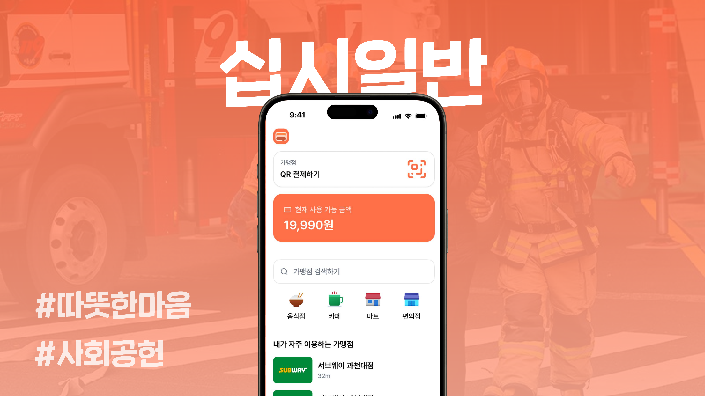

 

<h1>십시일반</h1>

편의점·프랜차이즈 매장을 지도에서 찾아 QR코드로 결제할 수 있는 모바일 결제 앱.

  
  
  
  
  
  

<b>제 11회 선린 해커톤 은상 수상작</b>

---

## 소개

십시일반은 신분증/소득증명 인증을 거친 사용자가 근처 가맹점을 지도에서 찾아 QR 코드로 결제할 수 있는 React Native(Expo) 모바일 앱입니다. 로그인 후 온보딩을 거쳐 위치 기반 매장 탐색, QR 결제, 주문 내역 조회까지 이어지는 흐름을 하나의 앱으로 단순화했습니다. 모바일 앱·백엔드 API·POS(가맹점용) 앱까지 세 개의 하위 프로젝트로 구성된 풀스택 서비스입니다.

## 구성

| 디렉터리 | 역할 |
|---|---|
| `apps/app` | React Native 모바일 앱 — 로그인/온보딩, 매장 지도 탐색, QR 결제·주문 내역 조회 |
| `apps/backend` | FastAPI 백엔드 — 인증, 가맹점·결제 데이터 관리, QR 결제 API |
| `apps/pos` | 가맹점용 React Native(Expo) 앱 — QR 결제 수신 및 주문 처리 |

## 역할

프론트엔드/메인 개발자로 화면 흐름 설계부터 구현까지 전담했습니다. 로그인 → 온보딩 → 서류 업로드 → QR 결제 → 주문 상태 확인으로 이어지는 다단계 상태 머신과 지도, 카메라/이미지 피커, QR 코드 생성 화면을 직접 구현했습니다.

## 느낀점

백엔드 연동 전 QR 결제 흐름을 먼저 검증하면서, 실제 연동 전에도 화면 전환과 상태 관리를 촘촘히 설계해두는 것이 협업 속도를 크게 높여준다는 것을 느꼈습니다.
